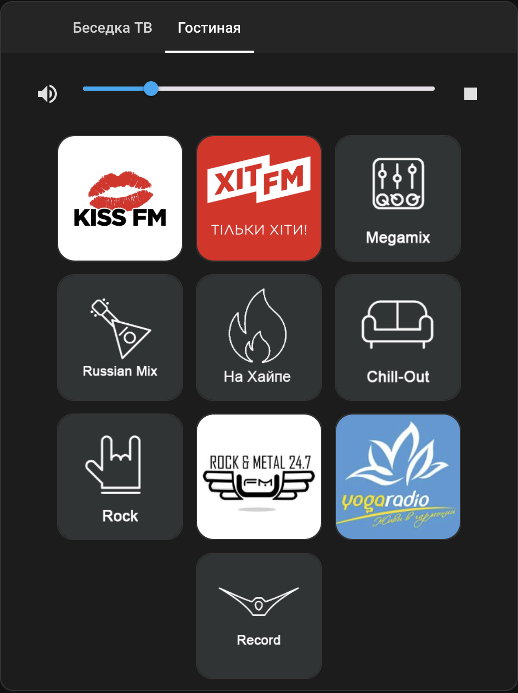

# Jukebox Card Icon for Home-Assistant

This is the media player user interface for Home-Assistant!

This is an upgrade of https://github.com/cyberjunky/jukebox-card.git which has an updated look and added radio station icons!

It allows you to set up a set of web radio stations (or perhaps other radio media identifiers like Spotify) and play them on the media player objects of your choice, such as Chromecast or Spotify Connect listeners.

You can send different media to different players, making it suitable for multi-room setups: let your kids listen to Frozen while you play Jazzing in the kitchen. Volume is also handled separately.

## Screenshot



## Usage

### Installation
Add a custom repository to HACS do the following:
1. Click on the 3 dots in the top right corner.
2. Select "Custom repositories"
3. Add the URL to the repository.
4. Select the correct type.
5. Click the "ADD" button.


### Configuration
Find stream URLs.
See this example setting a couple of Web radios to my two chromecast players.

*Excerpt of ui-lovelace.yaml*
```
type: custom:jukebox-card-icon
links:
  - name: Kiss FM
    url: https://online.kissfm.ua/KissFM
    icon: /local/icon/kissfm.jpg
  - name: Хит FM
    url: https://online.hitfm.ua/HitFM
    icon: /local/icon/xitfm.png
entities:
  - media_player.tv_besedka
  - media_player.foie
```

