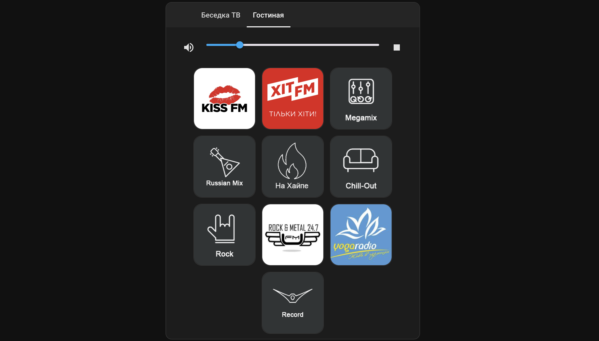

# Jukebox Card Icon for Home-Assistant

This is the media player user interface for Home-Assistant!
This is an upgrade of https://github.com/cyberjunky/jukebox-card.git which has an updated look and added radio station icons!
It allows you to set up a set of web radio stations (or perhaps other radio media identifiers like Spotify) and play them on the media player objects of your choice, such as Chromecast or Spotify Connect listeners.

You can send different media to different players, making it suitable for multi-room setups: let your kids listen to Frozen while you play Jazzing in the kitchen. Volume is also handled separately.

## Screenshot


## Acknowledgement
Apart from the home-assistant project, I need to say thanks to User [Bob_NL](https://community.home-assistant.io/u/Bob_NL)
who made his evergreen [Chromecast Radio](https://community.home-assistant.io/t/chromecast-radio-with-station-and-player-selection/12732)
available to all of us in the Home-Assistant forums. This jukebox is heavily deriving from the great work of all the
people in the thread.

## Usage
### Preparation
This will take time, but do set up your home-assistant to use the new [Lovelace](https://www.home-assistant.io/lovelace/)
frontend, if you're not using it yet.

### Installation
Grab a copy of [jukebox.js](./jukebox.js) and save it into your home-assistant's configuration, in a folder called
"www". So:

```
- /.homeassistant
|___ /configuration.yaml
|___ /www/jukebox-card.js
```


### Configuration
Find stream URLs, e.g. on [Radio-Browser.info](http://www.radio-browser.info/gui/#/)
See this example setting a couple of Web radios to my two chromecast players.

*Excerpt of ui-lovelace.yaml*
```
resources:
  - url: /local/jukebox-card.js
    type: module
views:
- name: Example
  cards:
  - type: "custom:jukebox-card"
    links:
      - url: http://streams.greenhost.nl:8080/jazz
        name: Concertzender Jazz
      - url: http://fs-insidejazz.fast-serv.com:8282/;stream.nsv
        name: Inside Jazz
      - url: http://stream.srg-ssr.ch/m/rsj/mp3_128
        name: Radio Swiss Jazz
      - url: http://stream.beachlatinoradio.com:8030/;?d=
        name: Beach Latino Radio
      - url: http://streams.calmradio.com/api/43/128/stream/;?d=
        name: Calm Radio
      - url: http://swr-swr1-bw.cast.addradio.de/swr/swr1/bw/mp3/128/stream.mp3
        name: SWR 1
      - url: http://94.23.252.14:8067/stream
        name: Nature Sounds
    entities:
      - media_player.wuerfel_wohnzimmer
      - media_player.wuerfel_kueche
```

```yaml
resources:
  - url: /community_plugin/jukebox-card/jukebox-card.js
    type: module
```
